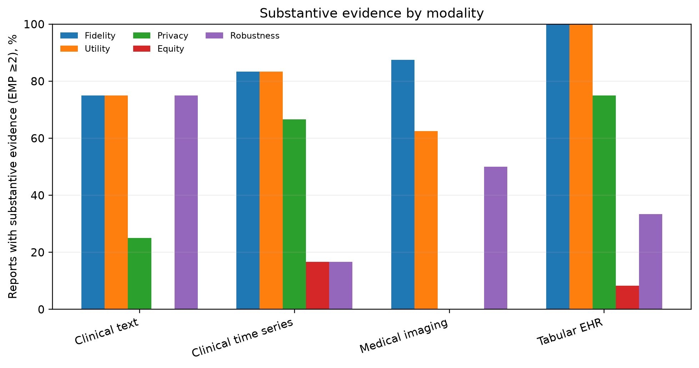
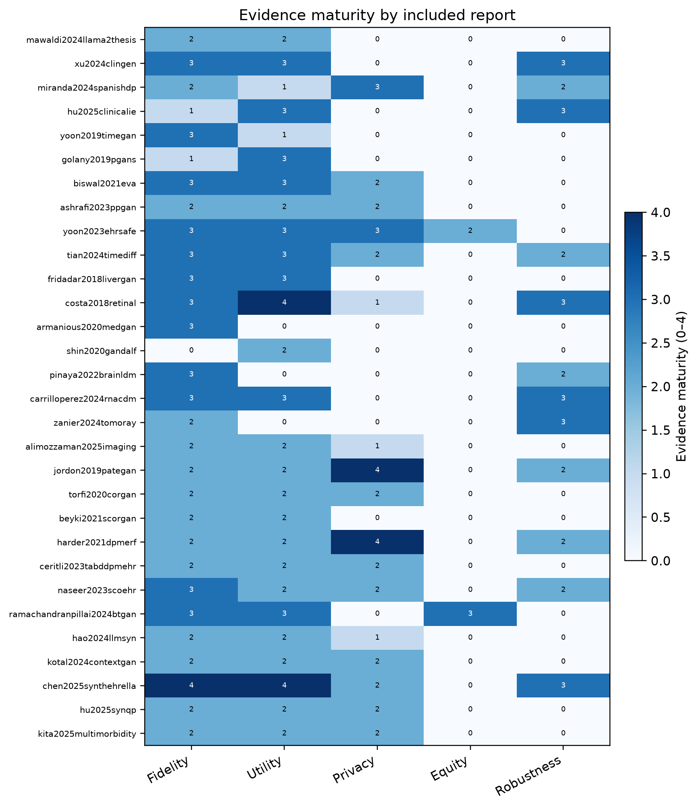

<div align="center">

# SynTrustBench

### A trustworthiness evidence standard for synthetic clinical data


[](LICENSE)
[](data/study_annotations.csv)

**Benchmark the evidence before ranking the model.**

SynTrustBench turns claims such as *realistic*, *clinically useful*, and *private* into explicit, source-linked evidence requirements. Version 0.1.0 combines a cross-modality benchmark specification with a primary-source pilot audit of 30 synthetic-clinical-data reports.

[Paper PDF](output/pdf/SynTrustBench_v0.1.0.pdf) · [Benchmark specification](benchmark_spec.md) · [Corpus](data/study_annotations.csv) · [Benchmark card](benchmark_card.yaml) · [arXiv source](output/SynTrustBench_arXiv_source_v0.1.0.zip)

</div>

---

## Why evidence comes first

Published synthetic-data results are rarely comparable as reported. The same metric name can hide different cohorts, splits, preprocessing, threat models, attackers, seeds, or clinical tasks. Copying those values into a leaderboard would produce precision without comparability.

SynTrustBench therefore evaluates the **maturity of the supporting evidence**, not whether a reported result favors a model. Its five dimensions are non-compensable: strong fidelity cannot erase missing privacy evidence, and global utility cannot cancel subgroup harm.

> **Phase 1 boundary:** this release is a benchmark specification and corpus audit. It does not train models or construct a literature-derived performance leaderboard.

## What SynTrustBench contributes

| Component | Purpose |
|---|---|
| **Evidence Maturity Profile** | Rates fidelity, clinical utility/validity, privacy, equity, and robustness/generalization independently from 0 to 4. |
| **Evaluability gate** | Labels each report `Pass`, `Conditional`, or `Fail` according to whether its protocol can support comparative use. |
| **Source-audited corpus** | Provides 62 structured fields for 30 reports, with primary-source links, explicit missingness, ambiguity flags, and a dated correction log. |
| **Benchmark card** | Captures datasets, cohorts, splits, threats, uncertainty, subgroup definitions, failure conditions, artifacts, and adjudication status. |
| **Reproducible analysis** | Regenerates all manuscript counts, audit tables, sensitivity analyses, figures, and integrity hashes from one annotation file. |

## Trustworthiness dimensions

| Dimension | Core question |
|---|---|
| **Fidelity** | Does the synthetic output preserve distributions, dependencies, support, rare patterns, and clinically meaningful structure? |
| **Clinical utility / validity** | Do conclusions or models transfer to real held-out patients, with appropriate calibration and clinical agreement? |
| **Privacy** | What can a declared attacker infer, and is any formal guarantee documented end to end? |
| **Equity** | Are fidelity, utility, and disclosure risk evaluated across protected and clinically important subgroups? |
| **Robustness / generalization** | Do findings survive seeds, perturbations, missingness, site or time shift, and external validation? |

Each report receives a five-element profile such as `[3, 2, 2, 0, 2]` plus a separate evaluability gate. SynTrustBench does not collapse that profile into a compensatory weighted score.

## Pilot corpus at a glance

These results describe the frozen 30-report pilot corpus; they are not estimates of the entire field.

| Evidence item | Reports | Share |
|---|---:|---:|
| Quantitative privacy evaluation | 17 / 30 | 56.7% |
| Differential privacy claimed by the report | 5 / 30 | 16.7% |
| Formal-DP documentation threshold met | 2 / 30 | 6.7% |
| Numeric privacy budget reported | 3 / 30 | 10.0% |
| Equity or subgroup evidence | 2 / 30 | 6.7% |
| Explicit robustness evaluation | 12 / 30 | 40.0% |
| External validation | 5 / 30 | 16.7% |
| Evaluability gate: Pass | 4 / 30 | 13.3% |

<p align="center">
  
</p>

<p align="center"><em>Percentages summarize evidence maturity in the audit corpus, not model performance.</em></p>

<details>
<summary><strong>View the report-level Evidence Maturity Profile heatmap</strong></summary>

<br>

<p align="center">
  
</p>

</details>

## Repository map

| Path | Contents |
|---|---|
| [`benchmark_spec.md`](benchmark_spec.md) | Normative benchmark definition and Phase 1/Phase 2 boundary. |
| [`data/study_annotations.csv`](data/study_annotations.csv) | Canonical 30-row, 62-field audit table. |
| [`data/study_annotations.jsonl`](data/study_annotations.jsonl) | Typed annotations validated against the JSON Schema. |
| [`data/SynTrustBench_corpus_audit.xlsx`](data/SynTrustBench_corpus_audit.xlsx) | Workbook export with the preserved original tab, codebook, summaries, correction log, and comparator table. |
| [`data/coding_codebook.md`](data/coding_codebook.md) | Operational extraction, missingness, maturity, and gate rules. |
| [`data/change_log.csv`](data/change_log.csv) | Source-linked record of material corrections. |
| [`benchmark_card.yaml`](benchmark_card.yaml) | Blank machine-readable benchmark card. |
| [`examples/ppgan_benchmark_card.yaml`](examples/ppgan_benchmark_card.yaml) | Completed example showing empirical privacy evaluation without a formal-DP claim. |
| [`scripts/`](scripts) | Corpus construction, validation, scoring, tables, figures, and manifests. |
| [`results/`](results) | Code-generated audit outputs consumed by the manuscript. |
| [`arxiv/`](arxiv) | Editable manuscript source and bibliography. |
| [`output/pdf/SynTrustBench_v0.1.0.pdf`](output/pdf/SynTrustBench_v0.1.0.pdf) | Compiled release-candidate manuscript. |

## Reproduce the audit

```bash
git clone https://github.com/neeamh/SynTrustBench-A-Trustworthiness-Evidence-Standard-for-Synthetic-Clinical-Data.git
cd SynTrustBench-A-Trustworthiness-Evidence-Standard-for-Synthetic-Clinical-Data

python3 -m venv .venv
source .venv/bin/activate
python -m pip install -r requirements.txt

python scripts/build_annotations.py
python scripts/validate_release.py
python scripts/score_evidence.py \
  --input data/study_annotations.csv \
  --output-dir results \
  --figure-dir figures
```

A successful validation reports 30 annotation rows and two schema-valid benchmark cards. The scoring script recomputes all headline values and writes a SHA-256 manifest for the generated outputs.

## How to use the benchmark

### Audit a published report

1. Extract the report using the [coding codebook](data/coding_codebook.md) and [annotation schema](data/annotation_schema.json).
2. Preserve `NR` for information that the source does not report; do not convert missing evidence into model failure.
3. Assign dimension-wise maturity using the predefined anchors.
4. Apply the evaluability gate independently of the maturity profile.
5. Record disagreements, ambiguity, and adjudication status rather than silently resolving them.

### Prepare a future controlled submission

Complete the [benchmark card](benchmark_card.yaml), declare the intended use and threat model, freeze the dataset/cohort/task/split tuple, report every seed and failed run, and test all mandatory floors. Direct model ranking belongs to the later controlled-execution track only.

## Scope and integrity notes

- The corpus is a **frozen pilot inherited from a prior review**, not a de novo exhaustive search through July 2026.
- The retained search flow contains a disclosed three-record discrepancy; reconstructed search syntax is not presented as the missing historical export.
- Two reports retain explicit ambiguity flags and are excluded in the released sensitivity analysis.
- Independent human double-coding and inter-rater agreement remain pending; no Cohen's kappa or Gwet's AC1 is claimed.
- Evidence maturity measures reporting strength, not whether the tested model performed well.

## Roadmap

| Track | Status | Deliverable |
|---|---|---|
| **Phase 1 — evidence benchmark** | Release candidate | Specification, maturity profile, evaluability gate, benchmark card, corrected corpus, and pilot audit. |
| **Phase 2 — controlled execution** | Planned | Frozen datasets and tasks, shared implementations, multi-seed experiments, explicit privacy attackers, and model-level comparisons. |

## Paper and citation

**SynTrustBench: A Trustworthiness Evidence Standard for Synthetic Clinical Data — A Systematic Evidence Synthesis, Benchmark Specification, and Pilot Audit**<br>
Neeam Shahriar Hayder, Iram Wajahat, and Syed Ahmad Chan Bukhari.

GitHub will generate citation metadata from [`CITATION.cff`](CITATION.cff). Until an arXiv identifier is assigned, the software release can be cited as:

```bibtex
@software{syntrustbench2026,
  author  = {Hayder, Neeam Shahriar and Wajahat, Iram and Bukhari, Syed Ahmad Chan},
  title   = {SynTrustBench: A Trustworthiness Evidence Standard for Synthetic Clinical Data},
  year    = {2026},
  version = {0.1.0},
  url     = {https://github.com/neeamh/SynTrustBench-A-Trustworthiness-Evidence-Standard-for-Synthetic-Clinical-Data}
}
```

## License

Code and benchmark artifacts are released under the [MIT License](LICENSE). The manuscript license will follow the option selected for the public preprint.
